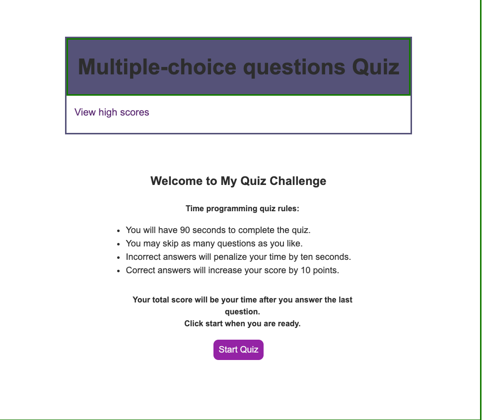
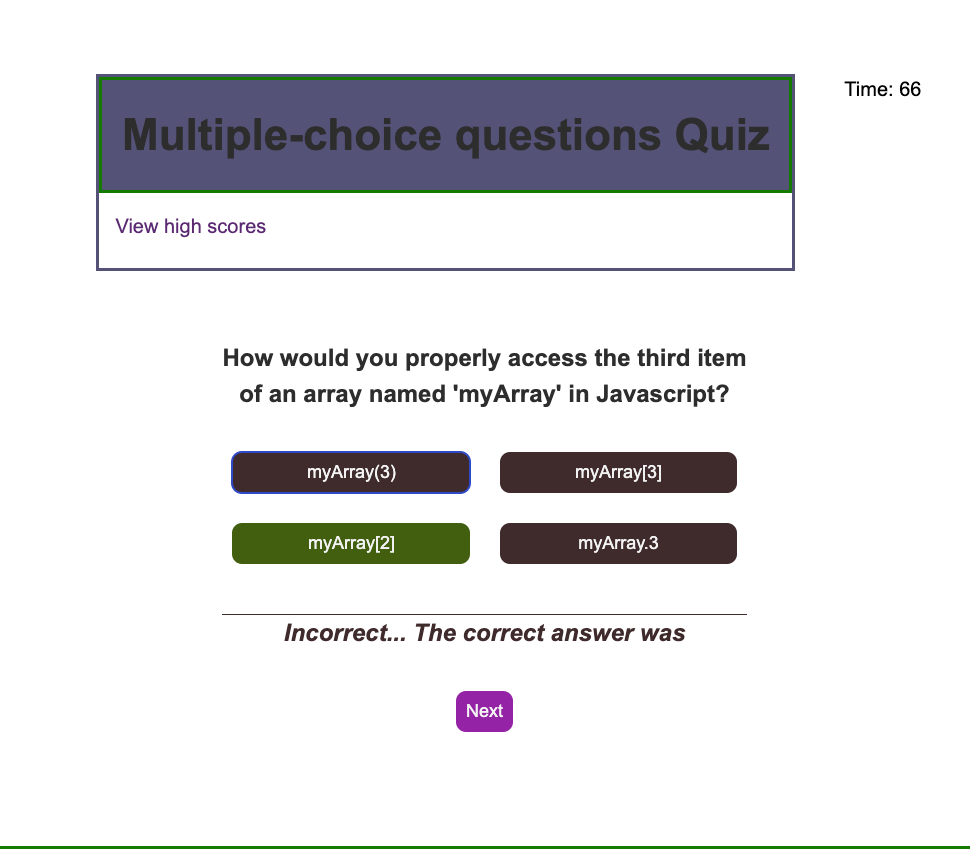
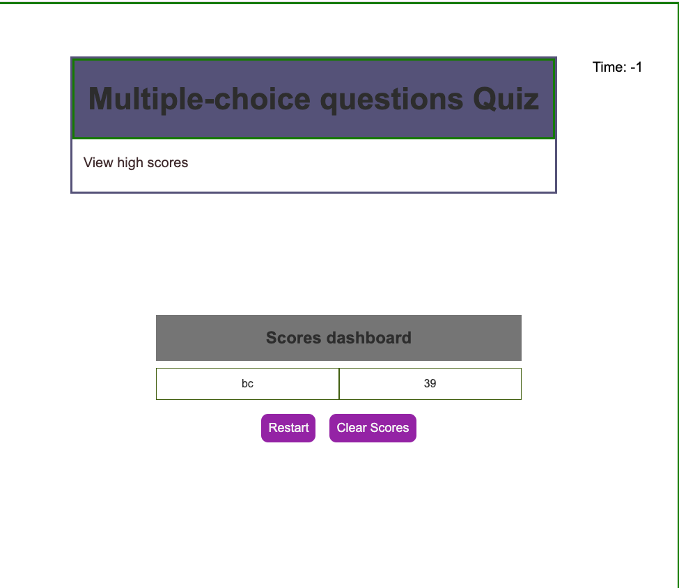

 Project: Code Quiz Programme

## Description

AS A coding boot camp student
I WANT to take a timed quiz on JavaScript fundamentals that stores high scores
SO THAT I can gauge my progress compared to my peers

A user clicks through an interactive coding quiz, then enters initials to save the high score before resetting and starting over.   

The quiz should have at least 07 questions on JavaScript fundamentals for 60 seconds.
The timer should start at 60 seconds and count down to 0. 
If the timer reaches 0 before the user finishes the quiz, the game is over and the user cannot save their score.
Each question should have four multiple-choice answers.
If the user selects the correct answer, they should see a message indicating that their answer is correct before moving on to the next question.
If the user selects an incorrect answer, they should see a message indicating that their answer is incorrect and 10 seconds should be subtracted from the timer before moving on to the next question.
Once the user has answered all of the questions or the timer reaches 0, they should be taken to a screen that shows their final score and allows them to enter their initials to save their high score.
The high scores should be stored locally on the user's device and displayed on a separate page that can be accessed by clicking a "High Scores" button on the main page.
The user should be able to reset the quiz by clicking a "Reset" button.

## Usage

The following give instructions and examples for use. Include screenshots as needed. 

Start page : 

 

The high scores stored locally on the user's device and displayed on a separate page that can be accessed by clicking a "High Scores" button on the main page.
T

  

